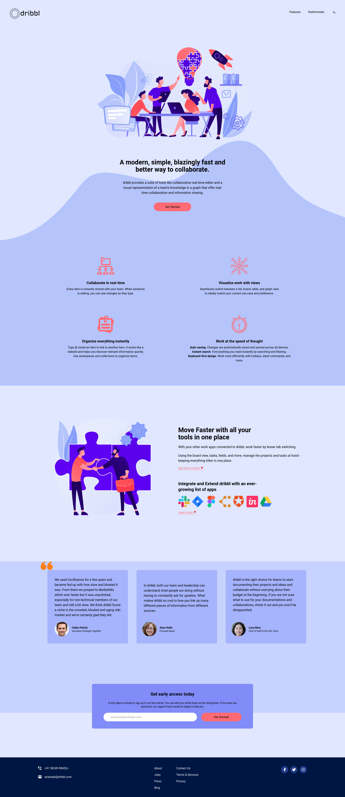
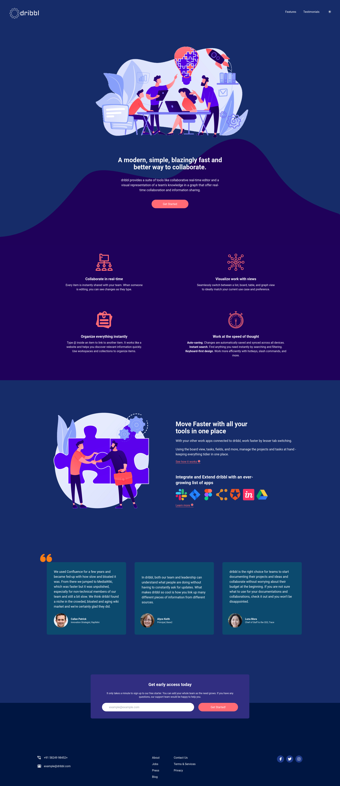
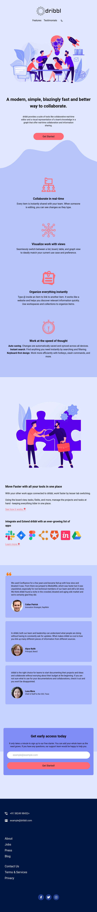
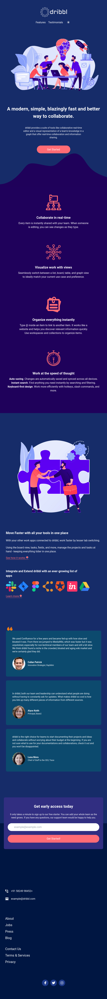

# Collaboration App Homepage
dribbl app home page from Udemy Course: TailwindCSS from Scratch and from Frontend Mentor Challenge.

This is a concept homepage design for a product that offers various tools for collaboration (akin to Slack, Notion, Nuclino etc.). This project utilizes TailwindCSS.

This homepage has two theme options (dark and light), which can be switched from a button in the nav bar. Also, in the navbar the options would scroll down to the portion of the page. This is achieved using Custom CSS classes, and DOM via Vanilla JavaScript. 

Also, the theme switching is aided by the following article:
https://www.freecodecamp.org/news/how-to-build-a-dark-mode-switcher-with-tailwind-css-and-flowbite/

The design is taken from Frontend mentor. The modifications are based on some famous cross-platform collaboration tools that are popular today. 

## ## Made Using:


## Usage
Install Dependencies:
```
npm install
```
Run Tailwind CLI:
```
npm run watch
```

## Screenshots
### Web-View


### Web-View Dark Mode


### Mobile View


### Mobile View Dark Mode
